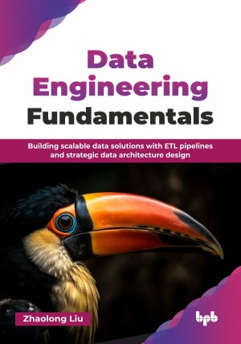

# Data Engineering Fundamentals

Building scalable data solutions with ETL pipelines and strategic data architecture design.

This is the repository for [Data Engineering Fundamentals
](https://bpbonline.com/products/data-engineering-fundamentals?_pos=1&_sid=6b1e9376b&_ss=r&variant=44566531080392),published by BPB Publications.

## About the Book
In today’s data-driven world, mastering data engineering is crucial for anyone looking to build robust data pipelines and extract valuable insights. This book simplifies complex concepts and provides a clear pathway to understanding the core principles that power modern data solutions. It bridges the gap between raw data and actionable intelligence, making data engineering accessible to everyone.

This book walks you through the entire data engineering lifecycle. Starting with foundational concepts and data ingestion from diverse sources, you will learn how to build efficient data lakes and warehouses. You will learn data transformation using tools like Apache Spark and the orchestration of data workflows with platforms like Airflow and Argo Workflow. Crucial aspects of data quality, governance, scalability, and performance monitoring are thoroughly covered, ensuring you understand how to maintain reliable and efficient data systems. Real-world use cases across industries like e-commerce, finance, and government illustrate practical applications, while a final section explores emerging trends such as AI integration and cloud advancements.

By the end of this book, you will have a solid foundation in data engineering, along with practical skills to help enhance your career. You will be equipped to design, build, and maintain data pipelines, transforming raw data into meaningful insights.

## What You Will Learn
• Understand data engineering base concepts and build scalable solutions.

• Master data storage, ingestion, and transformation.

• Orchestrates data workflows and automates pipelines for efficiency.

• Ensure data quality, governance, and security compliance.

• Monitor, optimize, and scale data solutions effectively.

• Explore real-world use cases and future data trends.
